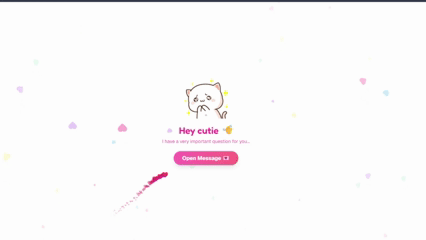

<div align="center">

  
  <h1>Little Blush 💕</h1>
  
  <p>
     A wholesome way to ask someone to be your Valentine.<br/>
     <i>Because asking the big question should feel special.</i>
  </p>
   
<!-- Badges -->
<p>
  
  
  
  
  
</p>
   
<h4>
    <a href="#star2-what-is-this">What's This?</a>
  <span> · </span>
    <a href="#link-how-to-use">How to Use</a>
  <span> · </span>
    <a href="#rocket-deploy-your-own">Deploy</a>
  <span> · </span>
    <a href="https://little-blush.vercel.app/">Try It!</a>
  </h4>
</div>

<br />

## :star2: What Is This?

Texting "will you be my valentine?" is fine, but sometimes you want to make a bit more of an effort. 

**Little Blush** is a simple, animated web page designed to make asking that special question feel a little warmer. Plus, it notifies you on Telegram the moment they say yes, so you aren't left refreshing your screen ✨

<br />

## :link: How to Use
 
1. **Get Your Telegram ID**  
   Open Telegram and message **[@Getmyid_bot](https://t.me/Getmyid_bot)**. It will instantly reply with your `ID`. Copy that number.
 
2. **Generate Your Link**  
   Visit the app (e.g., `https://little-blush.vercel.app/`). Paste your ID into the box and click "Generate Link".
 
3. **Share the Love**  
   Send the unique link it gives you to your special someone. When they open it, everything works like magic! ✨
 
> **Important:** Make sure you've started a chat with **[@mochidispachbot](https://t.me/mochidispachbot)** so it can message you!

## :camera: Preview

<div align="center">
  
</div>

<br />

## :rocket: Deploy Your Own

### Prerequisites

To get this running for yourself, you just need a few things:

1. **A Telegram Bot**
   - Message [@BotFather](https://t.me/BotFather) on Telegram.
   - Send `/newbot` and give it a name.
   - Copy the **API Token** it gives you.
   
2. **Bot Setup**
   - You need to start a chat with the bot that will handle the notifications.
   - Message **[@mochidispachbot](https://t.me/mochidispachbot)** (or your own bot) and click **Start**.
   - *Note: If you skip this, the bot won't have permission to message you.*

3. **Your Chat ID**
   - Message [@Getmyid_bot](https://t.me/Getmyid_bot) to find your personal Telegram Chat ID.

<br />

### Option 1: Deploy on Vercel (Recommended)

The quickest way to get your link live:

[](https://vercel.com/new/clone?repository-url=https://github.com/NethminaGunasekara/little-blush&env=TELEGRAM_BOT_TOKEN)

1. Click the deploy button above.
2. Connect your GitHub account.
3. When asked for Environment Variables, add:
   | Variable | Value |
   |----------|-------|
   | `TELEGRAM_BOT_TOKEN` | The token you got from BotFather |
4. Click **Deploy**.
5. Your site is now live!

<br />

### Option 2: Run Locally

If you prefer to run it on your own machine:

```bash
# Clone the repository
git clone https://github.com/NethminaGunasekara/little-blush.git
cd little-blush

# Install dependencies
npm install

# Set up environment variables
cp .env.template .env.local
```

Open `.env.local` and add your token:
```env
TELEGRAM_BOT_TOKEN=your_bot_token_here
```

Start the server:
```bash
npm run dev
```

The app will be running at `http://localhost:3000`.

<br />

## :gear: Environment Variables

| Variable | Required | Description |
|----------|----------|-------------|
| `TELEGRAM_BOT_TOKEN` | ✅ Yes | Your bot token from BotFather |

> **Note:** Your Chat ID isn't needed here. You'll enter it in the app itself to generate your personal link.

<br />


## :art: Tech Stack

- **Framework:** [Next.js 15](https://nextjs.org/)
- **Styling:** [Tailwind CSS](https://tailwindcss.com/)
- **Animations:** [Framer Motion](https://www.framer.com/motion/)
- **Icons:** [Lucide React](https://lucide.dev/)
- **Deployment:** [Vercel](https://vercel.com/)

<br />

## :heart: Credits

- **Mochi the Kitten**: For being adorable.
- **You**: For putting in the effort to make someone smile.

<br />

## :memo: License

This project is [MIT](./LICENSE) licensed.

---

<div align="center">
  <p>Made with 💕 and probably too much coffee</p>
  <p>Now go get yourself a Valentine! 🌹</p>
</div>
